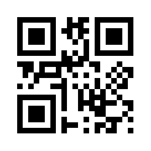

# A Basic iOS App to run SAP transactions

This app will open a barcode scanner and if it detects a barcode that translates to a purchase order, it will allow the user to record goods receipt for this purchase order.

Installation:
* Clone the repository
* Adapt the `SapGatewayClientConstants.swift` file bases on you SAP system **(Please note: This way of managing credentials is very unsafe and should not be used in production scenarios. This is for demonstration purposes only! )**
* Compile the project. You need an actual device for this app because it uses the device's camera. 
* Scan a barcode.

For instance, the purchase order `4500000373` would be represented as the following barcode (generated with [QR Code Generator](https://www.qr-code-generator.com))

