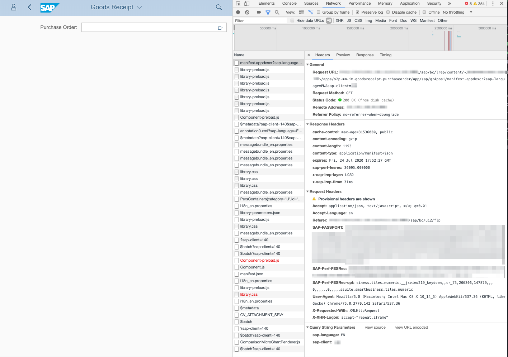

# How to reverse engineer the SAP oData API

Unfortunately, I was not able to get a hold of any decent documentation for the SAP oData API. < Add what did I find>

This left me with no other choice: I had to reverse engineer how SAP is using the oData API in its Fiori Apps.

## Log in to the SAP Easy Access and start the Fiori Launchpad

You need to log in to the SAP system using your credentials. You will find the URL to the Fiori Launchpad under Favorites. Click it.


Alternatively, the Fiori Launchpad URL consists of your SAP server, the port, and `/sap/bc/ui2/flp` as the path.

An example would be:

`your_server:8001/sap/bc/ui2/flp`

## Setup Chrome Network Recorder

I use the network recorder offered by the Chrome browser (Any other network logger will do, too.). You will find it by following `View > Developer > Developer Tools` in Chrome's menu. This will open the Developer Console, which provides the technical view of what the browser is doing.

Switch to the `Network` tab in the Developer Console. You will see a small red dot (the record button). Also you will see a checkbox `Preserve log`. Checking this checkbox will allow you to download the recorded network traffic. Make sure you check it.


## Dissecting an SAP Transaction

I choose the transaction **'Post Goods Receipt for Purchase Order'** (Transaction Code: MIGO) as an example for the process of how to understand the network traffic.


**This process assumes that you have purchase orders in your SAP system that are currently waiting for delivery to happen (a.k.a. the goods receipt step).**

Start the Network Recorder and execute the Transaction 'Post Goods Receipt for Purchase Order'. When you are done, the SAP system should present you with the text field for purchase orders and on the right side you should see the network recorder recording all the browser's calls to the SAP system.

<iframe width="560" height="315"
src="https://www.youtube.com/embed/MUQfKFzIOeU"
frameborder="0"
allow="accelerometer; autoplay; encrypted-media; gyroscope; picture-in-picture"
allowfullscreen></iframe>

The result should look like this.


Let's dissect the recorded network traffic:
* requests to `manifest.appdescr`, `$metadata`, `annotation0.xml` return the descriptions of the service
* requests to `*.js`,`*.json`, `*.properties` or `*.css` files are required for running the interface

The browser will send these requests only for the **first** time you post a goods receipt. When you post goods receipt again, the network traffic is a lot easier to understand.

The result of a second run should look like this.


We see five `$batch` requests (Let's ignore the request to the `i18n_en.properties` -- it's for the internationalization of the user interface). Essentially, a `$batch` request allow the user interface to call several request 'batched' together. An in-depth explanation of `$batch` requests is [here](https://blogs.sap.com/2018/05/06/batch-request-in-sap-gateway/).

To identify the specific requests that a `$batch` request is initiating, we will have to look into the payload of each `$batch` request.

In the case of recording goods receipt for a purchase order, the four `$batch` requests resemble the four requests required to record a goods receipt for a purchase order in the SAP Fiori user interface:

1. List all open purchase orders.
2. Open an inbound delivery for a selected purchase order.
3. Get the appropriate storage location for the received materials.
4. Post the goods receipt for the purchase order.

There is fifth `$batch` request (the one that does not relate to an `sap-client`). We will ignore this request for now, because this request gets potential attachments to the purchase order. We do not have any attachments.

Let's have a closer look at each of the four requests.

### List all open purchase orders

A detailed look at the first `$batch` request (to list all open purchase orders) will look like this (I have closed some sections of the request log to increase readability). The 'batched' requests are denoted in in the payload with an identifier starting with `--batch_`.


While the `$batch` request was directed at `/sap/opu/odata/sap/MMIM_GR4PO_DL_SRV` using `POST`, the 'batched' request was actually a `GET` request to `PoHelpSet` (which is a function of `MMIM_GR4PO_DL_SRV`). `PoHelpSet` is asked to select **all** `PurchaseOrder`s and their `PurchaseOrderItem`s, `PurchaseDocumentTypeName`s, `Supplier`s, `SupplierName`s, `SupplierCityName`s, `SupplyingPlant`s, `SupplyingPlantName`s, `Material`s, and `PurchaseOrderItemText`s for a client in the SAP system (`sap-client`). (`%2c` is a `,` in hexadecimal ASCII code.)

Please also note that the request includes a `x-csrf-token`, which is required to prevent [cross-site request forgery](https://en.wikipedia.org/wiki/Cross-site_request_forgery). This will be present in all the requests.

The JSON response to this request looks like this:

```
{
  "d": {
    "__count": "42",
    "results": [
      {
        "__metadata": {
          "id": "http://sap.system:port/sap/opu/odata/sap/MMIM_GR4PO_DL_SRV/PoHelpSet(PurchaseOrder='4500000041',PurchaseOrderItem='00010')",
          "uri": "http://sap.system:port/sap/opu/odata/sap/MMIM_GR4PO_DL_SRV/PoHelpSet(PurchaseOrder='4500000041',PurchaseOrderItem='00010')",
          "type": "MMIM_GR4PO_DL_SRV.PoHelp"
        },
        "PurchaseOrder": "4500000041",
        "PurchaseOrderItem": "00010",
        "Supplier": "",
        "SupplierName": "",
        "SupplierCityName": "",
        "SupplyingPlant": "",
        "SupplyingPlantName": "",
        "Material": "ORTR1105",
        "PurchaseOrderItemText": "Off Road Tires",
        "PurchasingDocumentTypeName": "Standard PO"
      },
      ...
    ]
  }
}
```

The `__count` tells that there are 42 open purchase orders in the system. For each of the purchase orders, we will get the `id` and the `uri` that point to the specific purchase order. Additionally, the requested information is listed as part of the results.

The next step is to get the detailed information for a purchase order to open an inbound delivery for that purchase order.

### Open an inbound delivery for a selected purchase order

The second `$batch` request will look like this:


While the `$batch` request was again directed at `/sap/opu/odata/sap/MMIM_GR4PO_DL_SRV` using `POST`, the 'batched' request was again a `GET` request to `GR4PO_DL_Headers` (which is a function of `MMIM_GR4PO_DL_SRV`).

`GR4PO_DL_Headers` is asked to expand on the selected purchase order to include all the items (`Header2Items`) and the potential stock types for the items (`Item2StockType`). Furthermore, this request is filtered so that the `SourceOfGR` is a purchase order (`PURORD`) and the `InboundDelivery` is for the selected purchase order (in this example: `4500000039`). Please note that `%2c` is a `,`, `%2F` is a `/`, `%20` is a ` `, and `%27` is a `'` in hexadecimal ASCII code. Furthermore, `eq` means equal and `and` refers to the logical operation.)

The response will look like this:

```
{
  "d": {
    "results": [
      {
        "__metadata": {
          "id": "http://sap.system:port/sap/opu/odata/sap/MMIM_GR4PO_DL_SRV/GR4PO_DL_Headers(InboundDelivery='4500000039',SourceOfGR='PURORD')",
          "uri": "http://sap.system:port/sap/opu/odata/sap/MMIM_GR4PO_DL_SRV/GR4PO_DL_Headers(InboundDelivery='4500000039',SourceOfGR='PURORD')",
          "type": "MMIM_GR4PO_DL_SRV.GR4PO_DL_Header"
        },
        "InboundDelivery": "4500000039",
        "SourceOfGR": "PURORD",
        "PurchasingDocumentType": "NB",
        "PurchasingDocumentTypeName": "Standard PO",
        "DocumentDate": "/Date(1565049600000)/",
        "PostingDate": "/Date(1565049600000)/",
        "DeliveryDocumentByVendor": "",
        "BillOfLading": "",
        "Vendor": "102039",
        "VendorName": "Boomtown Tire & Wheel",
        "SupplyingPlant": "",
        "SupplyingPlantName": "",
        "MaterialDocumentHeaderText": "",
        "Temp_Key": "",
        "VersionForPrintingSlip": "",
        "Header2Items": {
          "results": [
            {
              "__metadata": {
                "id": "http://sap.system:port/sap/opu/odata/sap/MMIM_GR4PO_DL_SRV/GR4PO_DL_Items(InboundDelivery='4500000039',DeliveryDocumentItem='000010',SourceOfGR='PURORD')",
                "uri": "http://sap.system:port/sap/opu/odata/sap/MMIM_GR4PO_DL_SRV/GR4PO_DL_Items(InboundDelivery='4500000039',DeliveryDocumentItem='000010',SourceOfGR='PURORD')",
                "type": "MMIM_GR4PO_DL_SRV.GR4PO_DL_Item"
              },
              "InboundDelivery": "4500000039",
              "DeliveryDocumentItem": "000010",
              "SourceOfGR": "PURORD",
              "AcctAssignmentCategory": "",
              "AcctAssignmentCategoryName": "",
              "Plant": "DL00",
              "PlantName": "Plant Dallas",
              "StorageLocation": "",
              "StorageLocationName": "",
              "Material": "ORTR1039",
              "MaterialName": "Off Road Tire",
              "PurchaseOrderItemText": "Off Road Tire",
              "Batch": "",
              "OrderedQuantity": "200",
              "OrderedQuantityUnit": "EA",
              "OpenQuantity": "200",
              "UnitOfMeasure": "EA",
              "QuantityInEntryUnit": "200",
              "EntryUnit": "EA",
              "StockType": "",
              "StockTypeName": "Unrestricted-Use",
              "Project": "",
              "ProjectDescription": "",
              "GLAccount": "",
              "GLAccountName": "",
              "UnloadingPointName": "",
              "GoodsRecipientName": "",
              "DeliveryCompleted": "",
              "FunctionalArea": "",
              "ProfitCenter": "",
              "ProfitCenterName": "",
              "CostCenter": "",
              "CostCenterName": "",
              "SalesOrder": "",
              "SalesOrderItem": "000000",
              "DocumentItemText": "",
              "OrderID": "",
              "InventorySpecialStockType": "",
              "InventorySpecialStockTypeName": "",
              "IsConsumptionMovement": false,
              "GoodsMovementReasonCode": "0000",
              "AssetNumber": "",
              "AssetNumberName": "",
              "SubAssetNumber": "",
              "Item2StockTypes": {
                "results": [
                  {
                    "__metadata": {
                      "id": "http://sap.system:port/sap/opu/odata/sap/MMIM_GR4PO_DL_SRV/StockTypeIndicators(InboundDelivery='4500000039',DeliveryDocumentItem='000010',SourceOfGR='PURORD',StockType='2')",
                      "uri": "http://sap.system:port/sap/opu/odata/sap/MMIM_GR4PO_DL_SRV/StockTypeIndicators(InboundDelivery='4500000039',DeliveryDocumentItem='000010',SourceOfGR='PURORD',StockType='2')",
                      "type": "MMIM_GR4PO_DL_SRV.StockTypeIndicator"
                    },
                    "InboundDelivery": "4500000039",
                    "DeliveryDocumentItem": "000010",
                    "SourceOfGR": "PURORD",
                    "ControlOfBatchTableField": "0000",
                    "StockType": "2",
                    "StockTypeName": "Quality Inspection",
                    "ControlOfReasonCodeTableField": "00000"
                  },
                  {
                    "__metadata": {
                      "id": "http://sap.system:port/sap/opu/odata/sap/MMIM_GR4PO_DL_SRV/StockTypeIndicators(InboundDelivery='4500000039',DeliveryDocumentItem='000010',SourceOfGR='PURORD',StockType='3')",
                      "uri": "http://sap.system:port/sap/opu/odata/sap/MMIM_GR4PO_DL_SRV/StockTypeIndicators(InboundDelivery='4500000039',DeliveryDocumentItem='000010',SourceOfGR='PURORD',StockType='3')",
                      "type": "MMIM_GR4PO_DL_SRV.StockTypeIndicator"
                    },
                    "InboundDelivery": "4500000039",
                    "DeliveryDocumentItem": "000010",
                    "SourceOfGR": "PURORD",
                    "ControlOfBatchTableField": "0000",
                    "StockType": "3",
                    "StockTypeName": "Blocked",
                    "ControlOfReasonCodeTableField": "00000"
                  },
                  {
                    "__metadata": {
                      "id": "http://sap.system:port/sap/opu/odata/sap/MMIM_GR4PO_DL_SRV/StockTypeIndicators(InboundDelivery='4500000039',DeliveryDocumentItem='000010',SourceOfGR='PURORD',StockType='')",
                      "uri": "http://sap.system:port/sap/opu/odata/sap/MMIM_GR4PO_DL_SRV/StockTypeIndicators(InboundDelivery='4500000039',DeliveryDocumentItem='000010',SourceOfGR='PURORD',StockType='')",
                      "type": "MMIM_GR4PO_DL_SRV.StockTypeIndicator"
                    },
                    "InboundDelivery": "4500000039",
                    "DeliveryDocumentItem": "000010",
                    "SourceOfGR": "PURORD",
                    "ControlOfBatchTableField": "0000",
                    "StockType": "",
                    "StockTypeName": "Unrestricted-Use",
                    "ControlOfReasonCodeTableField": "00000"
                  }
                ]
              }
            }
          ]
        }
      }
    ]
  }
}
```
This is a lot of information but essentially, the response contains a prepared goods receipt document ('Inbound Delivery') for each item in the purchase order (our purchase order has only one item.). Furthermore, it will list the potential stock types that the items can be flagged with (Quality Inspection, Blocked, Unrestricted-Use).

Please note that the document also contains a `DocumentDate` and a `PostingDate`. Both dates point to `1565049600000`, which is a unix timestamp plus three extra decimals (`000`). `1565049600` translates to August 6, 2019 midnight.

Once this goods receipt document is created, we have to select the appropriate storage location.

### Get the appropriate storage location for the received materials

The third `$batch` request will look like this:


This request is directed at `/sap/opu/odata/sap/MMIM_MATERIAL_DATA_SRV` (please note that this is a different URL than the previous requests) using `POST`, the 'batched' request was again a `GET` request to `MaterialStorLocHelps` (which is a function of `MMIM_MATERIAL_DATA_SRV`). This request returns the possible storage locations for the material. `MaterialStorLocHelps` filters that the `Material` (the purchased item) should be `ORTR1039` (the id of the purchased item) and that the storage facility (`Plant`) should be `DL00` (the id of a storage facility).

The response will look like this:

```
{
  "d": {
    "results": [
      {
        "__metadata": {
          "id": "http://sap.system:port/sap/opu/odata/sap/MMIM_MATERIAL_DATA_SRV/MaterialStorLocHelps(Material='ORTR1039',Plant='DL00',StorageLocation='RM00')",
          "uri": "http://sap.system:port/sap/opu/odata/sap/MMIM_MATERIAL_DATA_SRV/MaterialStorLocHelps(Material='ORTR1039',Plant='DL00',StorageLocation='RM00')",
          "type": "MMIM_MATERIAL_DATA_SRV.MaterialStorLocHelp"
        },
        "Material": "ORTR1039",
        "Plant": "DL00",
        "StorageLocation": "RM00",
        "StorageLocationName": "Raw Materials",
        "CalendarDate": "/Date(1565049600000)/",
        "CurrentStock": "1600.000",
        "QualityInspectionStockQuantity": "0.000",
        "ReturnsBlockedStockQuantity": "0.000",
        "TransferStockStorageLocQty": "0.000",
        "BlockedStockQuantity": "0.000",
        "RestrictedStockQuantity": "0.000",
        "BaseUnit": "EA"
      }
    ]
  }
}
```
This response shows that the purchased item (`ORTR1039`) has to be stored in the storage location `RM00` with the name `Raw Materials`. It also shows that the current stock level for this purchased item in this location is 1.600 units.

Once we select the appropriate storage location, we can post goods receipt.

### Post the goods receipt for the purchase order.

The final `$batch` request contains the actual goods receipt. The request will look like this:


Please note that we have an additional `changeset` in the request. A `changeset` denotes an actual transaction that cannot be executed partially.

The payload of the request looks like this:
```
{
  "InboundDelivery": "4500000039",
  "DocumentDate": "2019-08-06T00:00:00",
  "PostingDate": "2019-08-06T00:00:00",
  "SourceOfGR": "PURORD",
  "DeliveryDocumentByVendor": "",
  "MaterialDocumentHeaderText": "",
  "Temp_Key": "4500000039GR06082019101321",
  "BillOfLading": "",
  "VersionForPrintingSlip": "0",
  "Header2Items": [
    {
      "Material": "ORTR1039",
      "InboundDelivery": "4500000039",
      "DeliveryDocumentItem": "000010",
      "DocumentItemText": "",
      "QuantityInEntryUnit": "200",
      "EntryUnit": "EA",
      "OpenQuantity": "200",
      "UnitOfMeasure": "EA",
      "Plant": "DL00",
      "StorageLocation": "RM00",
      "StockType": "",
      "Batch": "",
      "AcctAssignmentCategory": "",
      "AssetNumber": "",
      "AssetNumberName": "",
      "SubAssetNumber": "",
      "GLAccount": "",
      "GLAccountName": "",
      "Project": "",
      "ProjectDescription": "",
      "GoodsMovementReasonCode": "0000"
    }
  ]
}
```

The payload contains the change information for the purchase order `4500000039`. The `DocumentDate` and `PostingDate` correspond to the request in step 2. The `Temp_Key` consists of the purchase order id, the signifier `GR` for goods receipt, and the timestamp. It also shows that of the material `ORTR1039`, 200 units were purchased (`OpenQuantity`) and that 200 units were delivered (`QuantityInEntryUnit`). Furthermore, it contains the selected storage location (`RM00`) in the storage facility (`DL00`).

The response consists of two elements:
1. A system message
2. A response JSON object.

If the goods receipt was successfully recorded, you will see a system message like this:
```
sap-message: {"code":"MIGO/012","message":"Material document 5000000347 2019 posted","longtext_url":"/sap/opu/odata/iwbep/message_text;o=LOCAL/","severity":"info","target":"","details":[]})
```
`MIGO` refers to the SAP transaction code for recording goods receipts. The message contains the material document number (here: `5000000347 2019`) and some administrative information.

The response JSON object looks like this:
```
{
  "d": {
    "__metadata": {
      "id": "http://sap.system:port/sap/opu/odata/sap/MMIM_GR4PO_DL_SRV/GR4PO_DL_Headers(InboundDelivery='4500000039',SourceOfGR='PURORD')",
      "uri": "http://sap.system:port/sap/opu/odata/sap/MMIM_GR4PO_DL_SRV/GR4PO_DL_Headers(InboundDelivery='4500000039',SourceOfGR='PURORD')",
      "type": "MMIM_GR4PO_DL_SRV.GR4PO_DL_Header"
    },
    "InboundDelivery": "4500000039",
    "SourceOfGR": "PURORD",
    "PurchasingDocumentType": "",
    "PurchasingDocumentTypeName": "",
    "DocumentDate": "/Date(1565049600000)/",
    "PostingDate": "/Date(1565049600000)/",
    "DeliveryDocumentByVendor": "",
    "BillOfLading": "",
    "Vendor": "",
    "VendorName": "",
    "SupplyingPlant": "",
    "SupplyingPlantName": "",
    "MaterialDocumentHeaderText": "",
    "Temp_Key": "4500000039GR06082019101321",
    "VersionForPrintingSlip": "0",
    "Header2Items": {
      "results": [
        {
          "__metadata": {
            "id": "http://sap.system:port/sap/opu/odata/sap/MMIM_GR4PO_DL_SRV/GR4PO_DL_Items(InboundDelivery='4500000039',DeliveryDocumentItem='000010',SourceOfGR='')",
            "uri": "http://sap.system:port/sap/opu/odata/sap/MMIM_GR4PO_DL_SRV/GR4PO_DL_Items(InboundDelivery='4500000039',DeliveryDocumentItem='000010',SourceOfGR='')",
            "type": "MMIM_GR4PO_DL_SRV.GR4PO_DL_Item"
          },
          "InboundDelivery": "4500000039",
          "DeliveryDocumentItem": "000010",
          "SourceOfGR": "",
          "AcctAssignmentCategory": "",
          "AcctAssignmentCategoryName": "",
          "Plant": "DL00",
          "PlantName": "",
          "StorageLocation": "RM00",
          "StorageLocationName": "",
          "Material": "ORTR1039",
          "MaterialName": "",
          "PurchaseOrderItemText": "",
          "Batch": "",
          "OrderedQuantity": "0.000",
          "OrderedQuantityUnit": "",
          "OpenQuantity": "200",
          "UnitOfMeasure": "EA",
          "QuantityInEntryUnit": "200",
          "EntryUnit": "EA",
          "StockType": "",
          "StockTypeName": "",
          "Project": "",
          "ProjectDescription": "",
          "GLAccount": "",
          "GLAccountName": "",
          "UnloadingPointName": "",
          "GoodsRecipientName": "",
          "DeliveryCompleted": "",
          "FunctionalArea": "",
          "ProfitCenter": "",
          "ProfitCenterName": "",
          "CostCenter": "",
          "CostCenterName": "",
          "SalesOrder": "",
          "SalesOrderItem": "000000",
          "DocumentItemText": "",
          "OrderID": "",
          "InventorySpecialStockType": "",
          "InventorySpecialStockTypeName": "",
          "IsConsumptionMovement": false,
          "GoodsMovementReasonCode": "0000",
          "AssetNumber": "",
          "AssetNumberName": "",
          "SubAssetNumber": "",
          "Item2StockTypes": {
            "__deferred": {
              "uri": "http://sap.system:port/sap/opu/odata/sap/MMIM_GR4PO_DL_SRV/GR4PO_DL_Items(InboundDelivery='4500000039',DeliveryDocumentItem='000010',SourceOfGR='')/Item2StockTypes"
            }
          }
        }
      ]
    }
  }
}
```
This response confirms our activities. This means that we have successfully recorded a goods receipt for a purchase order.

## Summary

We have learned that we need the following transactions to record a goods receipt for a purchase order:

1. `/sap/opu/odata/sap/MMIM_GR4PO_DL_SRV/PoHelpSet` shows us the open purchase orders.
2. `/sap/opu/odata/sap/MMIM_GR4PO_DL_SRV/GR4PO_DL_Headers` shows us a selected purchase order.
3. `/sap/opu/odata/sap/MMIM_MATERIAL_DATA_SRV/MaterialStorLocHelps` shows us appropriate storage locations.
4. Posting to `/sap/opu/odata/sap/MMIM_GR4PO_DL_SRV` will allow us to record a goods receipt.
